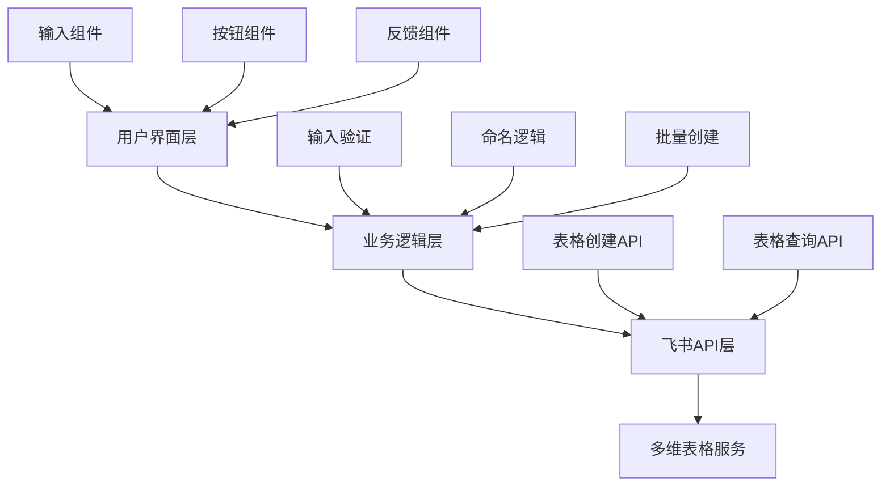
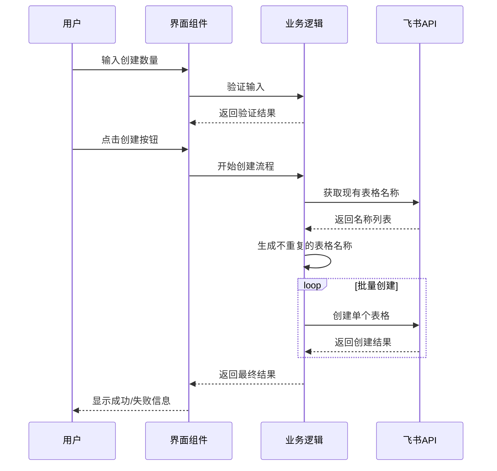

# 飞书多维表格边栏插件 - 批量创建空白表技术方案设计

## 技术架构

### 整体架构


## 技术栈

### 前端技术
- **框架**: React 18+ (飞书插件标准框架)
- **UI组件库**: @lark-base-team/ui-components
- **状态管理**: React Hooks (useState, useEffect)
- **样式**: CSS Modules + 飞书设计规范
- **构建工具**: Vite (飞书插件脚手架默认)

### API集成
- **飞书开放平台SDK**: @lark-base-team/js-sdk
- **多维表格API**: Base API for table operations

## 核心模块设计

### 1. 用户界面模块 (UI Layer)
```typescript
interface UIComponents {
  NumberInput: React.FC<{
    value: number;
    onChange: (value: number) => void;
    error?: string;
  }>;
  CreateButton: React.FC<{
    onClick: () => void;
    loading: boolean;
    disabled: boolean;
  }>;
  StatusMessage: React.FC<{
    type: 'success' | 'error' | 'info';
    message: string;
  }>;
}
```

### 2. 业务逻辑模块 (Business Logic)
```typescript
interface BusinessLogic {
  validateInput(count: number): ValidationResult;
  generateTableNames(count: number, existingNames: string[]): string[];
  createTablesInBatch(names: string[]): Promise<CreateResult[]>;
}
```

### 3. API交互模块 (API Layer)
```typescript
interface APIService {
  getExistingTableNames(): Promise<string[]>;
  createTable(name: string): Promise<TableInfo>;
  checkTableExists(name: string): Promise<boolean>;
}
```

## 数据流设计

### 创建表格流程


## 关键算法设计

### 表格命名算法
```typescript
function generateUniqueTableNames(count: number, existingNames: Set<string>): string[] {
  const names: string[] = [];
  let index = 1;
  
  while (names.length < count) {
    const candidateName = `空白表${index}`;
    if (!existingNames.has(candidateName)) {
      names.push(candidateName);
    }
    index++;
  }
  
  return names;
}
```

## 错误处理策略

### 错误类型定义
```typescript
enum ErrorType {
  INVALID_INPUT = 'INVALID_INPUT',
  API_ERROR = 'API_ERROR',
  PERMISSION_DENIED = 'PERMISSION_DENIED',
  NETWORK_ERROR = 'NETWORK_ERROR'
}

interface ErrorHandler {
  handleInputError(error: ValidationError): void;
  handleAPIError(error: APIError): void;
  handleNetworkError(error: NetworkError): void;
}
```

## 性能优化

### 批量创建优化
- 使用Promise.allSettled()并发创建表格
- 限制并发数量避免API限流
- 实现重试机制处理临时失败

### 用户体验优化
- 实时输入验证
- 创建进度显示
- 防抖处理避免重复点击

## 安全性考虑

### 输入安全
- 数字输入范围限制 (1-100)
- XSS防护
- 表格名称长度限制

### API安全
- 权限验证
- 错误信息脱敏
- 请求频率限制

## 测试策略

### 单元测试
- 输入验证逻辑测试
- 命名算法测试
- 错误处理测试

### 集成测试
- API调用测试
- 端到端创建流程测试

### 用户测试
- 界面交互测试
- 边界条件测试
- 性能压力测试

## 部署配置

### 插件配置
```json
{
  "name": "blank-table-creator",
  "version": "1.0.0",
  "type": "sidebar",
  "permissions": [
    "base:table:create",
    "base:table:read"
  ]
}
```

### 构建配置
- 代码压缩和混淆
- 资源优化
- 兼容性处理